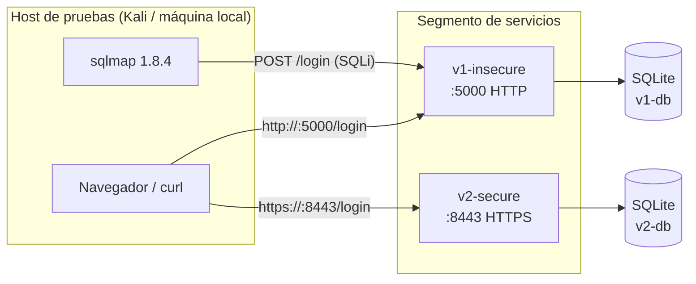
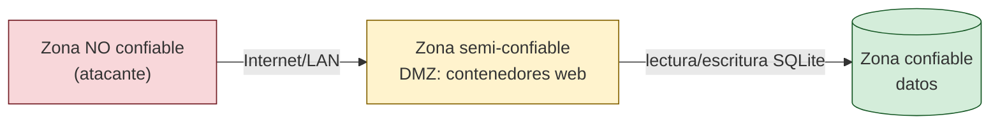
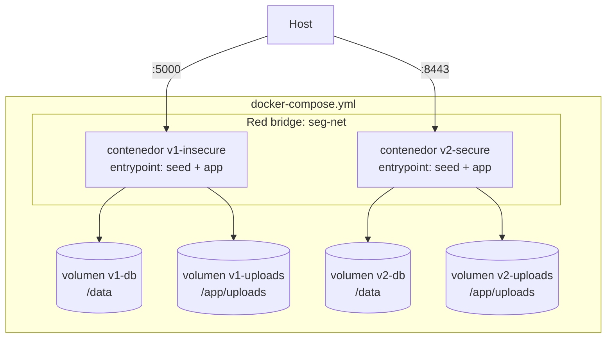

# Arquitectura de Despliegue — Fase 4

## 1. Objetivo

Documentar y materializar la arquitectura de despliegue del proyecto académico
de seguridad. El sistema consta de dos aplicaciones Flask que comparten el
mismo dominio funcional (gestión de archivos con autenticación) pero con
niveles de seguridad opuestos:

| Aplicación | Propósito | Seguridad |
|------------|-----------|-----------|
| `v1-insecure` | Réplica de malas prácticas (OWASP Top 10) | Vulnerable a propósito |
| `v2-secure` | Versión fortificada (mismas funcionalidades) | Hardened |

El despliegue permite **lado a lado** atacar `v1` y comprobar la mitigación en
`v2`, ideal para demostraciones de laboratorio.

## 2. Componentes

| Componente | Tecnología | Puerto | Función |
|------------|------------|--------|---------|
| `v1-insecure` | Flask + SQLite + Werkzeug dev server | 5000 (HTTP) | App vulnerable (RCE, SQLi, XSS, CSRF) |
| `v2-secure` | Flask + SQLite + Werkzeug dev server | 8443 (HTTPS) | App segura (parametrización, bcrypt, CSRF, headers) |
| Base de datos `v1` | SQLite `database.db` | interno | Usuarios en texto plano + archivos |
| Base de datos `v2` | SQLite `database.db` | interno | Usuarios con bcrypt + archivos |
| Cliente (atacante/demo) | Navegador, curl, sqlmap | — | Explotación y verificación |
| Despliegue | Docker Compose | — | Orquestación de ambos servicios |

## 3. Topología de red



**Criterios de la separación de segmentos:**
- `v1` se expone en HTTP plano porque su función es demostrar las
  vulnerabilidades (incluye ausencia de TLS).
- `v2` se expone únicamente por HTTPS (TLS 1.2+) con certificado generado por
  `certs/gen_cert.sh`.
- Cada servicio tiene su propia base de datos: el atacante no puede cruzar
  datos de una a otra.

## 4. Puertos expuestos

| Puerto | Servicio | Protocolo | Uso |
|--------|----------|-----------|-----|
| 5000 | v1-insecure | HTTP | Interfaz vulnerable |
| 8443 | v2-secure | HTTPS | Interfaz segura |

Ningún otro puerto se publica al host: las bases de datos SQLite y los
volúmenes son internos a la red `seg-net`.

## 5. Límites de confianza



- **NO confiable:** cualquier cliente externo. Solo puede llegar a los puertos
  web publicados.
- **Semi-confiable (DMZ):** los contenedores. `v1` es tratado como *comprometido
  por diseño*: aunque sea la misma red Docker, jamás comparte datos ni volúmenes
  con `v2`.
- **Confiable:** los volúmenes SQLite. Solo el contenedor propietario los monta.

## 6. Flujos de datos principales

1. **Login**: `POST /login` → query a `users`. En `v1` por concatenación
   (SQLi), en `v2` parametrizada + verificación bcrypt.
2. **Subida de archivos**: `POST /files/upload` → se guarda en `uploads/` y se
   registra en `files`. En `v1` sin validación (permite webshells/XSS
   almacenado); en `v2` con extensión permitida + nombre aleatorio (UUID).
3. **SQLmap (Fase 3)**: ataca únicamente `v1`, nunca `v2`. La red separada
   garantiza que un dump de `v1` no alcance los datos de `v2`.

## 7. Arquitectura Docker



**Decisiones de diseño:**

| Decisión | Justificación |
|----------|---------------|
| Volúmenes nombrados (`v1-db`, `v2-db`, …) | Los datos persisten entre `down/up` y `rebuild` |
| Entrada `DB_PATH`/`DATABASE` por env | La BD vive en el volumen `/data`, no en la imagen |
| Entrypoint `seed + app` | Base de datos sembrada de forma idempotente en cada arranque |
| Healthcheck con `urllib` (no `curl`) | Imágenes `python:slim` no traen `curl`; evita peso extra |
| `restart: unless-stopped` | Recuperación automática ante caídas |
| Red bridge privada `seg-net` | Los contenedores solo exponen sus puertos web al host |
| Sin servicio `unificada` | Se descarta la demo antigua: el entregable es `v1` vs `v2` |

## 8. Escenarios de despliegue

### 8.1 Local (sin Docker) — desarrollo

```bash
# v1 (puerto 5000)
cd v1-insecure && python seed.py && python app.py

# v2 (puerto 8443, requiere certs)
cd v2-secure && bash certs/gen_cert.sh && python seed.py && python run.py
```

### 8.2 Docker Compose — demostración (recomendado)

```bash
docker compose up --build -d
docker compose ps            # ambos healthy
```

Accesos: `http://localhost:5000` y `https://localhost:8443` (aceptar cert
autofirmado o confiar la CA local).

### 8.3 Máquina virtual (VirtualBox)

Escenario: una VM Ubuntu 24.04 con Docker (despliegue 8.2) o apps nativas
(8.1). Desde el host se accede por `http://<ip-vm>:5000` y
`https://<ip-vm>:8443`. Recomendación: **dos NICs** — NAT para salida a
internet y host-only para el acceso de la demo.

### 8.4 GNS3 (topología de red)

Escenario de red: máquina atacante (Kali) en una LAN y el servidor de
aplicaciones en otra, separados por un router. Permite demostrar el ataque
SQLmap a través de la red y el aislamiento de segmentos. La app se ejecuta en
Docker o en una VM unida a la topología GNS3 como *Cloud*.

## 9. Contramedidas a nivel de despliegue (v2)

- **TLS en todas las comunicaciones** (8443) con HSTS.
- **Aislamiento de datos**: volúmenes privados por servicio.
- **Secretos por variable de entorno** (`SECRET_KEY`), nunca en la imagen.
- **Certificados self-signed versionados como scripts** (`gen_cert.sh`), nunca
  las llaves privadas (ver `.gitignore`).
- **Healthchecks** para detectar caídas; reinicio automático.

En producción real se sustituiría el self-signed por Let's Encrypt (certbot) y
Werkzeug dev server por Gunicorn/uWSGI detrás de un reverse proxy (nginx),
quedando documentado en la Fase 5.
